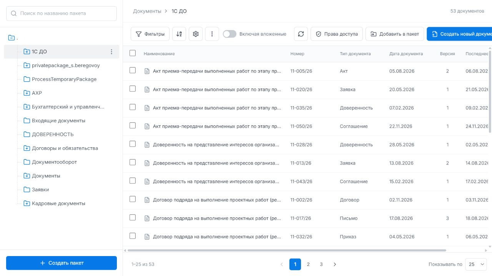
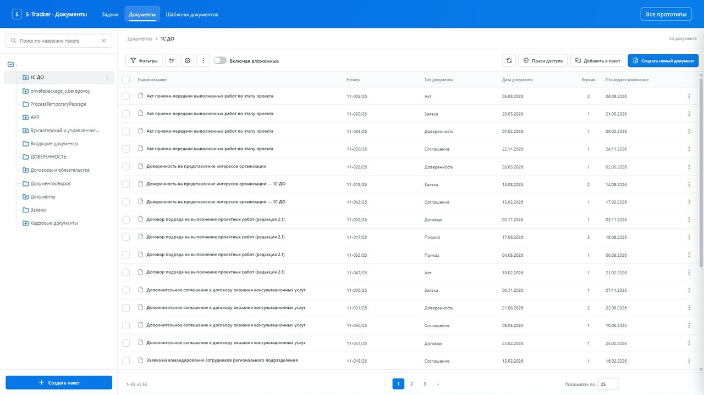
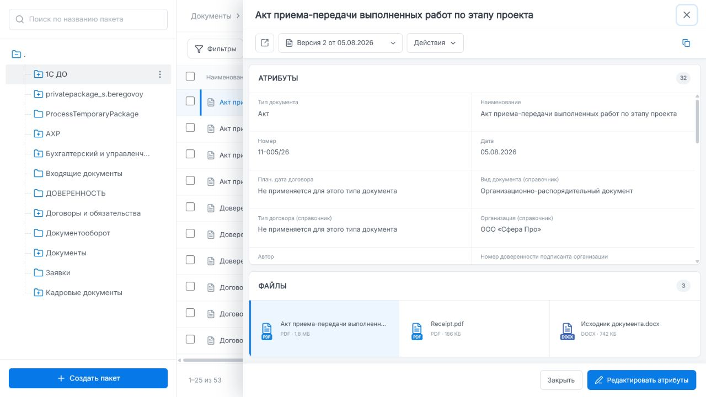
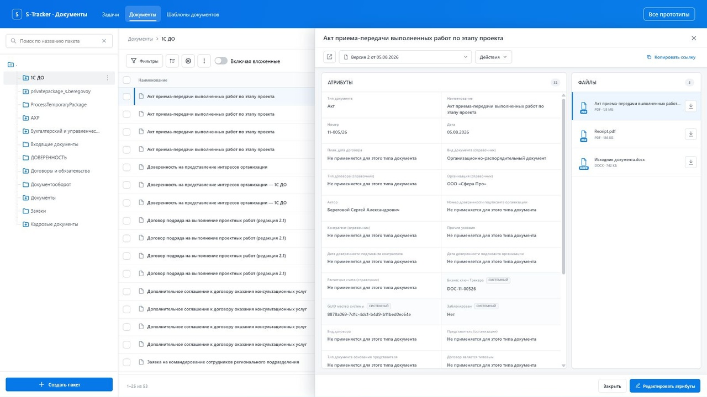
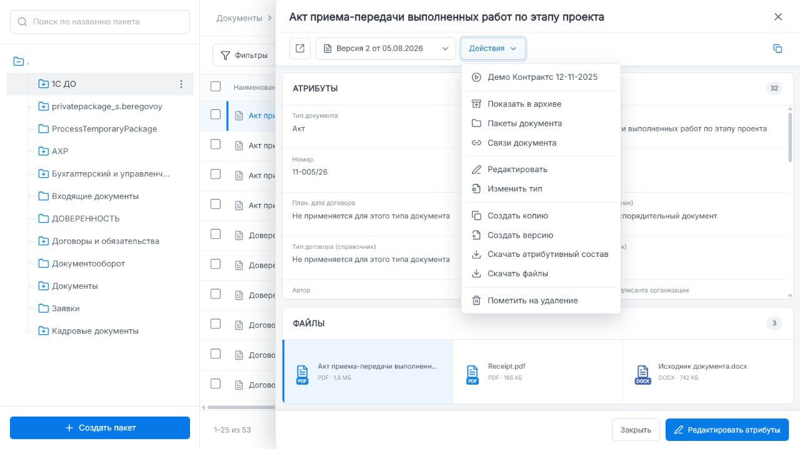
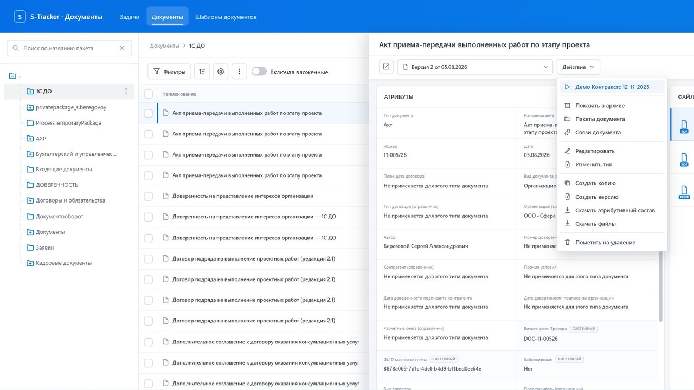

# Визуальный аудит миграции Documents Workspace

Дата: 03.08.2026  
Эталон: MagicPath component `434608350467080192`, revision `434701870192275456`  
Результат миграции: `local-stands/documents/`

## Область проверки

Проверены список документов, панель пакетов, карточка документа, меню действий, файловый блок, адаптивные правила, иконки и основные клавиатурные сценарии.

Эталонный canvas-фрейм имеет внутренний размер `1600×960`. Прямой preview MagicPath был зафиксирован при `1280×720`. Видимое состояние локального стенда было зафиксировано при рабочем кадре `1600×900`. Из-за артефакта композитинга встроенного браузера локальный screenshot сохранялся мозаикой; принятые изображения являются точной обрезкой первого полного тайла без изменения содержимого интерфейса.

## Принятые визуальные доказательства

### 1. Список документов

### 2. Карточка документа

### 3. Меню действий

## Подтверждено без расхождений

- ширина панели пакетов по умолчанию `320 px`;
- высота строки дерева `36 px`, отступы уровней и выделение выбранного пакета;
- изменение ширины панели пакетов клавиатурой и возврат двойным кликом: `320 → 336 → 320 px`;
- высоты контекстной строки, toolbar, заголовка таблицы, строки таблицы и пагинации: `58 / 62 / 42 / 48 / 62 px`;
- ширина меню действий `256 px`, высота `402 px`, `11` действий и `4` разделителя;
- `32` атрибута и `3` файла;
- немодальный drawer с `aria-modal="false"`;
- переключение между документами без закрытия drawer;
- возврат фокуса на наименование последнего документа после закрытия карточки;
- у видимых icon-only кнопок присутствуют доступные наименования.

## Исправлено по результатам проверки

### Система координат drawer

Drawer теперь монтируется внутри рабочей области документов и позиционируется относительно нее. Хедер локального стенда больше не компенсируется отдельным смещением самой карточки.

### Изменение ширины карточки пользователем

На левой границе drawer добавлен resize-handle. При перетаскивании влево карточка расширяется, при перетаскивании вправо — сужается; базовая ширина `1060 px`, базовый минимум `840 px`, а слева сохраняется `440 px` рабочей области на широком фрейме. Реализованы синяя индикация, клавиши `ArrowLeft` / `ArrowRight`, увеличенный шаг с `Shift`, сброс клавишей `Home` и двойным кликом, а также доступная роль `separator` с текущим диапазоном и значением.

### Пустой поиск пакетов и иконки карточки

Кнопка очистки скрывается при пустом запросе и больше не уменьшает полезную ширину поля. Толщина линий иконок карточки и файлов приведена к эталонному значению; расхождения иконок дерева пакетов и сортировки остаются отдельной задачей общего реестра.

## Несоответствия

### P1. Потерян адаптивный breakpoint карточки

В MagicPath при ширине до `1340 px` атрибуты и файлы перестраиваются вертикально: файлы переходят в нижнюю панель высотой `156 px`, а три файла располагаются горизонтально.

На локальном стенде аналогичная перестройка начинается только при `760 px`. В диапазоне `761–1340 px` сохраняется боковая файловая панель шириной `350 px`. Результат — узкая область атрибутов, длинный вертикальный файловый блок и download-кнопки там, где эталон уже показывает компактные горизонтальные карточки.

### P1. Мобильный контракт расходится с эталоном

MagicPath при ширине до `720 px` оставляет только панель пакетов и скрывает рабочую область документов. Локальный стенд при `760 px` сохраняет одновременно панель пакетов, таблицу и drawer. Это создает риск горизонтального переполнения и недоступных областей интерфейса.

### P2. Иконки перенесены не 1:1

- эталонная иконка раскрываемого пакета — `FolderPlus`, `viewBox 24`, stroke `1.8`; локальная — собственная геометрия `viewBox 20`, stroke `1.7`;
- сортировка в эталоне использует `ArrowDownAZ`, локальная версия показывает универсальную стрелку со строками.

Размеры контейнеров в основном совпадают, но сами знаки выглядят легче и имеют другую семантику.

### P2. Типографический контракт частично потерян

Эталон задает явные `line-height` для базовых зон (`24 px` и `18 px`). В локальном стенде часть этих зон наследует `line-height: normal`. Фиксированные высоты строк пока маскируют разницу, но при переносе длинных значений и масштабировании текста возможен вертикальный дрейф.

### P2. Хедер локального стенда требует учета в адаптивной модели

Хедер — ожидаемая часть локального прототипа, а не ошибка. Однако он уменьшает полезную высоту рабочей области на `76 px`. Сейчас карточка просто смещена вниз, без отдельного height-based reflow. При малой высоте окна атрибуты получают дополнительный скролл, а файловая панель продолжает занимать всю доступную высоту.

## Рекомендуемая последовательность исправлений

1. Согласовать поведение при `≤720/760 px` и при небольшой высоте окна без изменения текущего расположения блоков карточки до отдельного продуктового решения.
2. Заменить оставшиеся приблизительные SVG дерева и сортировки на точные иконки эталона через общий реестр.
3. Восстановить явные line-height в оставшихся базовых зонах.

Перестройка файлов под атрибуты при `1340 px` не выполнялась в этой корректировке по прямому условию сохранить расположение блоков внутри карточки.

## Ограничения проверки

- по изображениям нельзя подтвердить полное соответствие WCAG или фактические коэффициенты контраста;
- встроенный браузер не предоставил отдельное управление viewport/zoom, поэтому breakpoint-поведение подтверждено сочетанием эталонного screenshot и проверки CSS обеих реализаций;
- backend-операции меню остаются демонстрационными и оценивались только как интерфейсные реакции.
