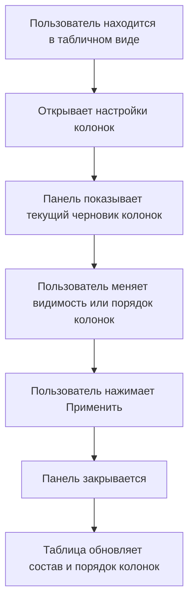

# Настройки колонок: поведение

Файл описывает действия пользователя в интерфейсе настройки колонок и реакцию прототипа. Структура панели описана в `01-structure.md`; данные, состояния и правила применения - в `03-data-states-rules.md`.

## 1. Основной пользовательский путь

Главная цель компонента - изменить состав или порядок колонок таблицы без изменения данных задач.

## 2. Открытие панели

| Действие пользователя | Реакция интерфейса |
|---|---|
| Нажимает кнопку настройки колонок в табличном виде | Открываются overlay и правая панель `Настройки` |
| Нажимает кнопку настройки колонок в системном overlay | Открывается та же правая панель `Настройки` |
| Панель открывается | Создается черновик из уже примененных настроек текущего контекста |
| Панель открывается | Библиотека атрибутов закрыта, видна основная область `Общие атрибуты` |

Если для текущего контекста нет пользовательских настроек, черновик собирается из базового набора колонок.

## 3. Закрытие без применения

| Действие пользователя | Реакция |
|---|---|
| Нажимает крестик в хедере панели | Панель и overlay закрываются |
| Кликает по overlay | Панель и overlay закрываются |
| Библиотека была раскрыта | При закрытии панели библиотека тоже закрывается |
| В черновике были изменения | Основная таблица остается без изменений |

Закрытие панели не записывает черновик в примененные настройки.

## 4. Скрытие и показ колонки

| Действие пользователя | Что меняется в панели | Что меняется в таблице |
|---|---|---|
| Снимает чекбокс у колонки | Колонка в черновике получает `visible: false` | Ничего до `Применить` |
| Ставит чекбокс у колонки | Колонка в черновике получает `visible: true` | Ничего до `Применить` |
| Нажимает `Применить` | Панель закрывается | Таблица перерисовывается без скрытых колонок и с включенными колонками |

Фиксированные колонки `cb`, `id`, `title` не отображаются в списке и не отключаются.

## 5. Изменение порядка колонок

| Действие пользователя | Реакция |
|---|---|
| Начинает перетаскивать строку колонки | Строка получает состояние перетаскивания |
| Перетаскивает строку выше или ниже | Позиция строки в списке меняется |
| Завершает перетаскивание | Новый порядок записывается в черновик |
| Нажимает `Применить` | Таблица получает новый порядок колонок |

Порядок фиксированных колонок не меняется: `cb`, `id`, `title` всегда остаются первыми.

## 6. Кнопка `По умолчанию`

| Действие | Реакция |
|---|---|
| Пользователь нажимает `По умолчанию` | Черновик возвращается к базовому набору колонок текущего контекста |
| После сброса к базе | Выбранный пресет в черновике становится `Базовое отображение` |
| До нажатия `Применить` | Основная таблица не меняется |
| После `Применить` | Таблица показывает базовый набор колонок |

`По умолчанию` не удаляет сохраненные пресеты.

## 7. Кнопка `Применить`

| Шаг | Что происходит |
|---|---|
| Пользователь нажимает `Применить` | Текущий видимый список строк панели считывается как черновик |
| Черновик нормализуется | Удаляются недопустимые, повторяющиеся и фиксированные ключи |
| Настройки сохраняются для текущего контекста | Примененное состояние колонок обновляется |
| Панель закрывается | Overlay скрывается, библиотека закрывается |
| Список задач перерисовывается | Таблица показывает примененные колонки |
| Счетчики левой панели обновляются | Числа в навигации пересчитываются по текущему контексту |

Кнопка `Применить` является единственной точкой, после которой изменения из панели попадают в основную таблицу.

## 8. Открытие библиотеки атрибутов

| Действие пользователя | Реакция |
|---|---|
| Нажимает кнопку библиотеки в футере | Панель переходит в раскрытое состояние |
| Библиотека раскрыта | Слева появляется область `Библиотека атрибутов` |
| Нажимает кнопку библиотеки повторно | Библиотека закрывается |

Раскрытие библиотеки само по себе не меняет таблицу и не меняет черновик колонок.

## 9. Добавление и возврат атрибутов библиотеки

| Действие пользователя | Что происходит в черновике | Что происходит в таблице |
|---|---|---|
| Нажимает добавление у атрибута в библиотеке | Атрибут добавляется в конец черновика колонок с `visible: true` | Ничего до `Применить` |
| Добавленный атрибут появился в `Общие атрибуты` | У строки появляется действие возврата в библиотеку | Ничего до `Применить` |
| Нажимает возврат в библиотеку у добавленного атрибута | Атрибут удаляется из черновика колонок и снова доступен в библиотеке | Ничего до `Применить` |

Если пользователь закроет панель без `Применить`, добавление или возврат атрибута не изменит основную таблицу.

## 10. Сброс добавленных атрибутов библиотеки

| Условие | Состояние кнопки `Сбросить` |
|---|---|
| Библиотека закрыта | Кнопка не отображается |
| Библиотека открыта, но библиотечных колонок в черновике нет | Кнопка видна, но disabled |
| Библиотека открыта, есть минимум одна добавленная библиотечная колонка | Кнопка активна |

| Действие | Реакция |
|---|---|
| Нажимает активную кнопку `Сбросить` | Все добавленные из библиотеки атрибуты удаляются из черновика |
| После сброса | Библиотека снова показывает удаленные атрибуты как доступные |
| До `Применить` | Основная таблица не меняется |

## 11. Пресеты внутри панели

Пресеты в этой панели работают как варианты черновика колонок.

| Действие | Реакция |
|---|---|
| Открывает список пресетов | Показывается `Базовое отображение` и сохраненные пресеты текущего контекста |
| Выбирает пресет | Черновик колонок перестраивается по выбранному пресету |
| Удаляет пресет | Пресет удаляется из списка; если он был выбран, черновик возвращается к базе |
| Меняет черновик относительно выбранного пресета | Кнопка `Сохранить` становится активной |
| Нажимает `Сохранить` | Открывается модальное окно сохранения пресета |

Выбор пресета не меняет основную таблицу до `Применить`.

## 12. Сохранение пресета

| Действие | Реакция |
|---|---|
| Нажимает активную кнопку `Сохранить` | Открывается модальное окно `Сохранение пресета` |
| Вводит название и нажимает `Подтвердить` | Текущий черновик сохраняется как пресет текущего контекста |
| Сохраняет пресет | Новый пресет становится выбранным в черновике |
| Нажимает `Отмена` или крестик | Модальное окно закрывается, пресет не создается |

Сохранение пресета не применяет его к таблице автоматически. Для изменения таблицы нужно нажать `Применить` в панели настроек.

## 13. Пустые и граничные состояния

| Ситуация | Поведение |
|---|---|
| Нет пользовательского состояния колонок | Панель показывает базовый набор колонок |
| В библиотеке нет доступных атрибутов по поиску | В списке библиотеки отображается `Атрибуты не найдены` |
| В черновике остались только фиксированные колонки | Фиксированные колонки все равно не показываются в списке, но остаются в таблице |
| Сохраненный пресет содержит недоступные ключи | При чтении состояния недоступные ключи отбрасываются |
