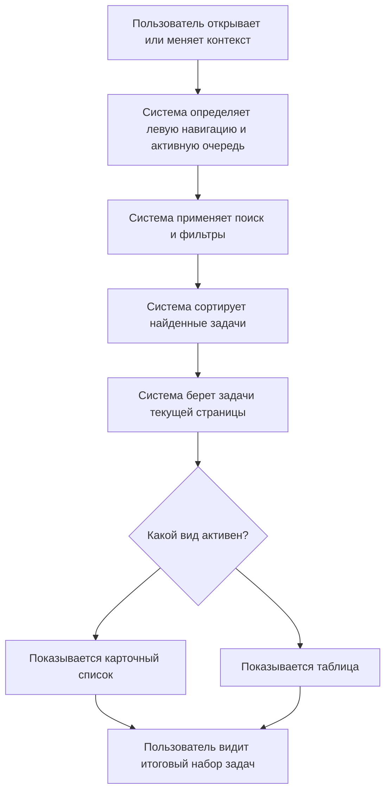

# Список задач: поведение

Файл описывает действия пользователя со списком задач и реакцию интерфейса. Структура областей описана в `01-structure.md`; правила данных и состояний - в `03-data-states-rules.md`.

## 1. Основной пользовательский путь

Главная цель компонента - показать пользователю итоговый список задач в выбранном контексте и дать возможность работать с задачами в карточном или табличном виде.

## 2. Первичная загрузка

| Шаг | Что происходит |
|---|---|
| Открытие прототипа | Инициализируется состояние приложения |
| Контекст навигации | По умолчанию выбран режим `Все задачи` |
| Очередь | По умолчанию активна очередь `К исполнению` |
| Вид списка | По умолчанию активен карточный вид |
| Рендер | Система собирает задачи очереди `К исполнению`, применяет текущие фильтры, сортирует, пагинирует и выводит карточки |

## 3. Переключение карточного и табличного вида

| Действие пользователя | Реакция интерфейса |
|---|---|
| Нажимает кнопку карточного вида | Карточный контейнер становится видимым, табличный контейнер скрывается |
| Нажимает кнопку табличного вида | Табличный контейнер становится видимым, карточный контейнер скрывается |
| Переходит в табличный вид | Кнопки `Настройка колонок` и `Скачать` становятся видимыми |
| Возвращается в карточный вид | Кнопки `Настройка колонок` и `Скачать` скрываются |

Переключение вида не меняет выбранный домен, очередь, фильтры, поиск и текущий набор задач.

## 4. Переключение очереди

Очереди описаны отдельно в `../queues/`. Для списка задач важно следующее поведение.

| Действие пользователя | Что меняется в списке |
|---|---|
| Пользователь нажимает сегмент очереди | Активным становится выбранный сегмент |
| После выбора очереди | Список перерисовывается задачами этой очереди |
| После перерисовки | Обновляются счетчики очередей и левой навигации |

## 5. Изменение левой навигации

| Контекст слева | Что показывает список |
|---|---|
| `Все задачи` | Задачи всех бизнес-доменов, доступных текущей роли |
| Конкретный бизнес-домен | Только задачи выбранного бизнес-домена |
| Сгруппированное значение | Только задачи домена и значения, по которому создана группировка |
| Пользовательская группа | Только задачи, входящие в эту группу |

При смене контекста список перерисовывается в текущей активной очереди.

## 6. Поиск и фильтры

Фильтрация описана отдельно в `../filters/`. Для списка задач важно следующее.

| Действие | Реакция списка |
|---|---|
| Пользователь вводит текст в поле `Поиск по задачам` | Список сразу перерисовывается без нажатия `Применить` |
| Пользователь нажимает `Применить` в панели фильтров | Панель закрывается, список показывает только задачи, прошедшие фильтры |
| Пользователь сбрасывает фильтры | Список возвращается к задачам текущего домена и очереди без фильтрационного сужения |

После изменения фильтров счетчики левой навигации и очередей также пересчитываются.

## 7. Выбор одной задачи

| Где пользователь нажимает | Что происходит |
|---|---|
| Чекбокс карточки | Карточка получает или теряет выбранное состояние |
| Чекбокс строки таблицы | Строка получает или теряет выбранное состояние |
| Email автора | Выбор задачи не меняется; email копируется в буфер |

При выборе задачи ее `id` добавляется в общий набор выбранных задач. При снятии выбора `id` удаляется из этого набора.

## 8. Поведение карточки задачи

Карточка задачи описана структурно в `01-structure.md`.

| Действие или условие | Реакция карточки |
|---|---|
| Пользователь наводит курсор на обычную карточку | Фон карточки становится светло-серым, синяя обводка не появляется |
| Пользователь наводит курсор на наименование | Текст наименования получает акцентный цвет |
| Пользователь выбирает карточку чекбоксом | Чекбокс становится активным, `id` задачи добавляется в выбранные задачи |
| Выбранная обычная карточка остается выбранной | Карточка сохраняет selected-состояние до снятия чекбокса |
| Карточка новой задачи | Карточка имеет зеленоватую подложку и зеленую левую индикацию |
| Карточка просроченной задачи | Карточка имеет розоватую подложку и красную левую индикацию; дата просрочки выделяется красным |
| Пользователь нажимает email автора | Email копируется, выбор карточки не меняется |

## 9. Поведение строки таблицы

Строка таблицы описана структурно в `01-structure.md`.

| Действие или условие | Реакция строки таблицы |
|---|---|
| Пользователь наводит курсор на обычную строку | Фон меняется у всех ячеек строки, включая закрепленные ячейки |
| Пользователь наводит курсор на наименование | Текст наименования получает акцентный цвет |
| Пользователь выбирает строку чекбоксом | Чекбокс становится активным, строка получает selected-состояние |
| Строка новой задачи | Все ячейки строки имеют зеленоватую подложку, первая ячейка показывает зеленую левую индикацию |
| Строка просроченной задачи | Все ячейки строки имеют розоватую подложку, первая ячейка показывает красную левую индикацию; дата просрочки выделяется красным |
| Пользователь нажимает email автора | Email копируется, выбор строки не меняется |
| Пользователь скроллит таблицу горизонтально | Ячейки `cb`, `id`, `title` остаются закрепленными |

## 10. Что одинаково и что отличается

| Правило | Карточка | Строка таблицы |
|---|---|---|
| Использует тот же объект задачи | Да | Да |
| Поддерживает выбор чекбоксом | Да | Да |
| Показывает email автора с копированием | Да | Да |
| Показывает статус цветным тегом | Да | Да, если колонка `status` активна |
| Показывает одну фиксированную дату | Да | Нет, дата зависит от активных колонок |
| Зависит от настроек колонок | Нет | Да |
| Имеет выбор всех видимых задач | Нет | Да, через чекбокс заголовка |

## 11. Выбор всех видимых строк в таблице

Выбор всех через заголовок есть только в табличном виде.

| Состояние видимых строк таблицы | Состояние чекбокса в заголовке |
|---|---|
| Не выбрана ни одна видимая строка | Пустой чекбокс |
| Выбрана часть видимых строк | Indeterminate: внутри чекбокса синий квадрат 12 x 12 px |
| Выбраны все видимые строки | Чекбокс с синей заливкой и белой галочкой |

| Действие пользователя | Реакция |
|---|---|
| Нажимает пустой чекбокс в заголовке | Выбираются все строки текущей видимой страницы таблицы |
| Нажимает чекбокс в заголовке, когда все видимые строки выбраны | Снимается выбор со всех строк текущей видимой страницы таблицы |
| Снимает выбор с одной строки после выбора всех | Чекбокс в заголовке становится indeterminate |

## 12. Появление панели массовых действий

Панель массовых действий является отдельным связанным блоком, но запускается выбором задач в списке.

| Условие | Что происходит |
|---|---|
| Выбрана минимум одна задача | Появляется плавающая панель внизу экрана |
| Количество выбранных задач изменилось | Число в панели меняется на текущий размер набора выбранных задач |
| Пользователь нажимает кнопку снятия выделения | Все чекбоксы очищаются, строки и карточки теряют выбранное состояние, панель скрывается |

## 13. Копирование email автора

| Действие | Реакция |
|---|---|
| Пользователь нажимает email автора в карточке или таблице | Адрес копируется в буфер обмена |
| Копирование успешно | Появляется toast `Адрес скопирован` |
| Копирование не удалось | Появляется toast `Не удалось скопировать адрес` |

Клик по email не должен выбирать строку или карточку задачи.

## 14. Пагинация

| Действие пользователя | Реакция списка |
|---|---|
| Нажимает номер страницы | Список перерисовывается задачами выбранной страницы |
| Нажимает стрелку вперед | Текущая страница увеличивается на 1 |
| Нажимает стрелку назад | Текущая страница уменьшается на 1 |
| Меняет очередь, домен или фильтры | Список пересобирается, страница возвращается к первой, если не передан режим сохранения страницы |

Пагинация работает с итоговым набором задач после применения навигации, очереди, поиска и фильтров.

## 15. Горизонтальный скролл таблицы

| Действие | Реакция |
|---|---|
| Пользователь скроллит таблицу вправо | Колонки `cb`, `id`, `title` остаются закрепленными слева |
| Таблица имеет горизонтальный сдвиг больше 0 | У закрепленной области появляется визуальное отделение справа |
| Пользователь возвращает скролл к началу | Визуальное отделение справа убирается |

## 16. Пустой результат

| Условие | Реакция |
|---|---|
| После всех правил отбора нет задач | Вместо строк или карточек отображается пустое состояние |
| Пользователь меняет контекст или сбрасывает фильтры | Список снова перерисовывается по новым условиям |
