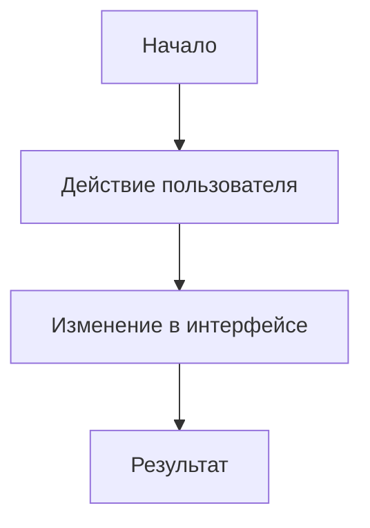

# Flow: название сценария

## Зачем нужен сценарий

Коротко: какую задачу пользователя решает этот сценарий.

## Участники интерфейса

- компонент 1;
- компонент 2;
- компонент 3.

## Сценарий

## Что меняется в состоянии

- выбранное значение;
- видимый список;
- открытая панель;
- активный фильтр.

## Когда обновлять этот документ

Обновлять, если меняется путь пользователя, порядок действий, результат или состояние интерфейса.
