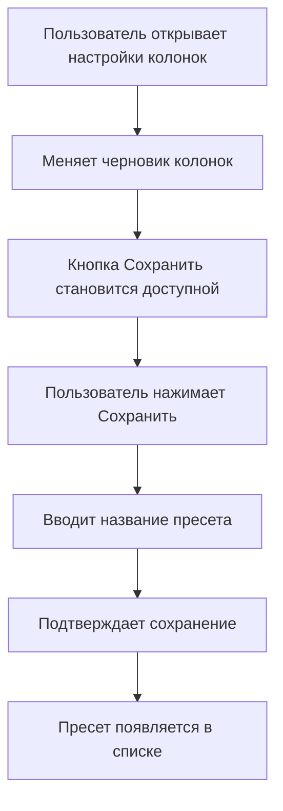
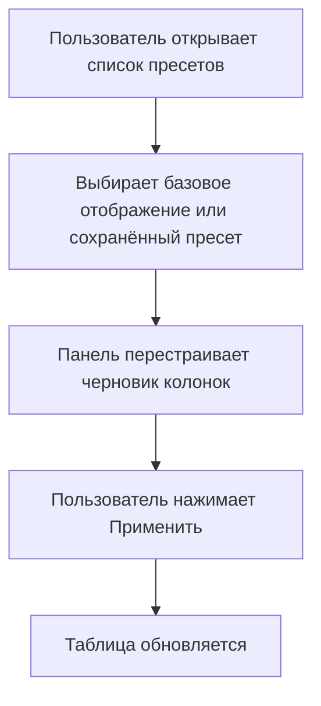
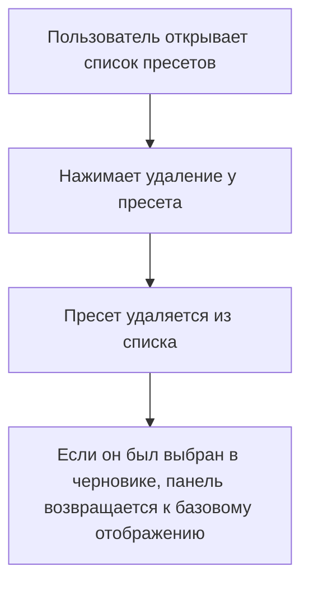

# Flow: пресеты колонок

## Зачем нужен сценарий

Пресет сохраняет удобный вариант отображения таблицы: какие колонки видны, какие скрыты, какие атрибуты добавлены из библиотеки и в каком порядке стоят колонки.

Это не шаблон задачи и не шаблон данных. Пресет относится только к виду таблицы.

Как и остальные настройки колонок, пресеты работают через черновик панели. Основной грид списка задач меняется только после кнопки "Применить".

## Участники интерфейса

- панель настройки колонок;
- список текущих колонок;
- выпадающий список пресетов;
- кнопка "Сохранить";
- модальное окно "Сохранение пресета";
- поле "Название пресета";
- кнопка удаления пресета;
- кнопка "По умолчанию";
- кнопка "Применить".

## Что считается пресетом

Пресет хранит состояние колонок для текущего раздела:

- какие колонки включены;
- какие колонки скрыты;
- в каком порядке расположены колонки;
- какие атрибуты были добавлены из библиотеки.

Пресет не меняет сами задачи и не меняет библиотеку атрибутов.

## Сценарий сохранения пресета

## Сценарий выбора пресета

## Сценарий удаления пресета

## Важные правила

Пресет сохраняется отдельно для текущего раздела или домена.

Если пользователь работает в "Все задачи", пресет относится к режиму "Все задачи".

Если пользователь работает в конкретном бизнес-домене, пресет относится к этому домену.

Кнопка "Сохранить" становится доступной только тогда, когда текущий черновик колонок отличается от выбранного пресета или базового отображения.

Если выбран "Базовое отображение", панель возвращается к стандартному набору колонок в черновике.

Выбор пресета не меняет основной грид сразу. Для обновления таблицы пользователь должен нажать "Применить".

## Ограничение текущего прототипа

В текущем прототипе пресеты хранятся внутри текущей работы страницы. Это значит, что они помогают проверить сценарий, но не являются полноценным постоянным пользовательским сохранением через сервер или базу данных.

## Когда обновлять этот документ

Обновлять, если меняется:

- расположение управления пресетами;
- логика сохранения пресета;
- логика выбора пресета;
- логика удаления пресета;
- связь пресета с доменом или режимом "Все задачи";
- способ постоянного хранения пресетов;
- отличие пресетов от базового отображения;
- правило применения пресета к основной таблице.
