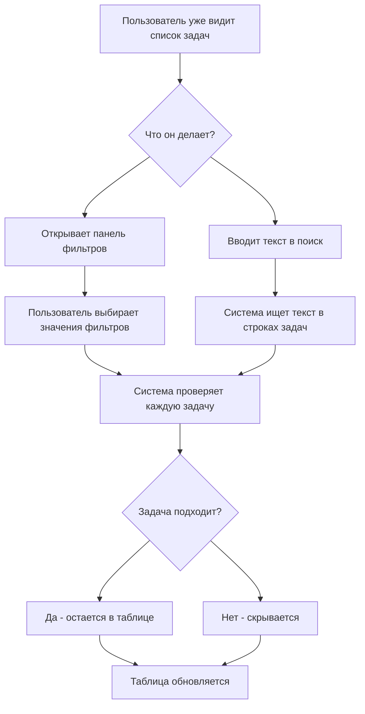

# Flow: поиск и фильтрация задач

## Зачем нужен сценарий

Поиск и фильтры помогают сократить список задач до нужного набора.

## Участники интерфейса

- поле поиска;
- кнопка фильтров;
- панель фильтров;
- таблица задач;
- активный бизнес-домен;
- активная очередь.

## Сценарий

## Как работает логика

Сначала уже выбран домен и очередь. Фильтры работают поверх этого выбора.

Например:

- выбраны "Закупки ТМЦ";
- выбрана очередь "В работе";
- выбран фильтр SLA = Warning.

Таблица покажет только задачи по закупкам, которые в работе и имеют SLA = Warning.

## Какие фильтры зависят от домена

У разных доменов разные признаки.

- Строительные договоры: тип документа, контрагент, сумма.
- Закупки ТМЦ: бизнес-юнит, SLA.
- Поручения СД: объект, критичность.

В режиме "Все задачи" система может показывать общий набор фильтров.

## Когда обновлять этот документ

Обновлять, если меняется:

- состав фильтров;
- логика поиска;
- зависимость фильтров от домена;
- порядок применения фильтров;
- поведение кнопок применить/сбросить.
